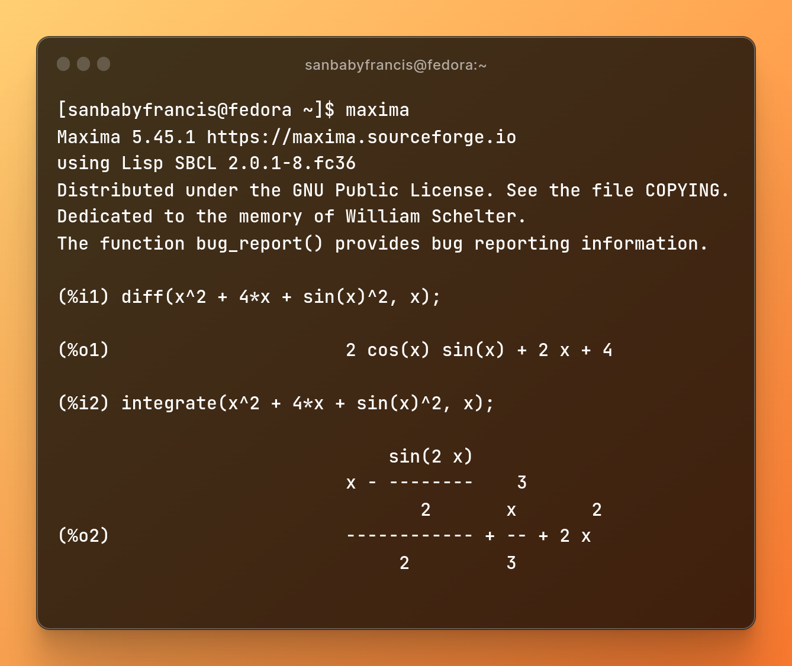
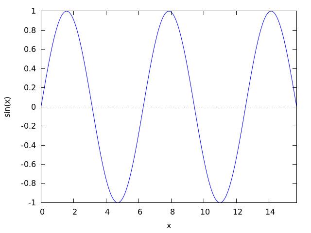
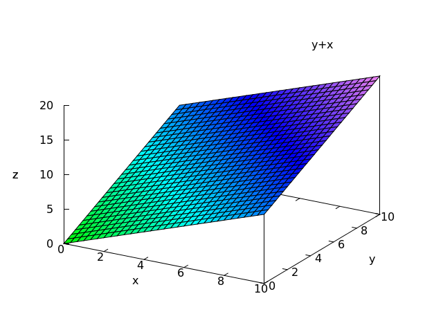

A Computer Algebra System is a piece of software that would help you compute various problems that you encounter in Mathematics or Engineering. You could think of it as an advanced scientific calculator that could perform integration, solve your differential equations and much more. However, CAS can never be a substitute for a mathematician (It only does the boring stuff. Contrary to the popular belief, math has got little to do with computation).

Throughout the blog, I’ll be discussing about [Maxima](http://maxima.sourceforge.net/) – an open-source, general-purpose CAS which is widely used in academia for symbolic computations. Unlike other tools, Maxima is easy to use and light in weight. [Mathematica](https://www.wolfram.com/mathematica/) (a proprietary software), [SageMath](https://www.sagemath.org/), [SymPy](https://www.sympy.org/en/index.html) (a Python package with CAS capabilities) are other available options.

Wait! Do I sound boring? Then let’s get started. We’ll try to solve a few problems (that you’d find in a typical high school math curriculum) using Maxima. I will be using a Linux operating system to run the program (Wait a minute! Linux is worth learning. I might write about the Linux commandline in another blog!). Don’t worry, you could run Maxima on Windows or Mac too.

Before I begin let me tell you something, I do not intend to teach you Maxima (Hey, I came across the tool the other day and I am not an expert at it 😅). My aim is pretty simple – I want to introduce you to various open-source projects and Maxima is indeed a great tool to begin with.

So let’s begin.

## Elementary Mathematics

Yes let’s begin, from the basics. Performing arithmetic oprerations in Maxima is really easy.

`2 + 7;` would return `9`

`4 * 2;` would return `8`

`6 / 2;` would return `3`

Every statement ends with `;` in Maxima. So make sure you add the semicolon.

## Trigonometry

The `trigsimp()` function in Maxima simplifies a trigonometric expression.
Suppose we have the expression, (1 – sin(x)^2). Then the following input: 

```
trigsimp(1 - sin(x)^2);
```

would produce the output: 

```
cos(x)^2
```

You could also expand a trigonometric expression using `trigexpand()` function. For example, the following input: 

```
trigexpand(tan(3*x)); 
```

would produce the output:


## Calculus

The `diff()` and `integrate()` commands are useful while differentiating or integrating a mathematical function. Suppose you have, f(x) = x^2 + 4*x + sin(x)^2, then to differentiate or to integrate the function with respect to x, we provide the following as inputs:

```
diff(x^2 + 4*x + sin(x)^2, x);
integrate(x^2 + 4*x + sin(x)^2, x);
```

You will get the output as:



## Plotting Functions

The command `plot2d()` can produce a 2-dimensional plot of any given function. For example, the following input plots a function, f(x) = sin(x) from x = 0 to 5π:

```
plot2d(sin(x), [x, 0, 5*%pi]);
```



We could also generate 3-dimensional plots using the command `plot3d()`. Let us plot the function, f(x, y) = x + y in 3 axes. Let x and y ranges from 0 to 10.

```
plot3d(x + y, [x, 0, 10], [y, 0, 10]);
```

We get the following plot as the output:

